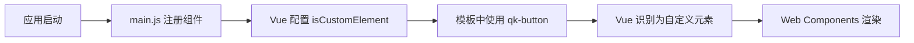

# Web Components 按钮组件实现思路

## 📋 整体架构

### 技术选型
- **Vue 3** + **TypeScript**：使用 Vue 3 的 `defineCustomElement` API 将 Vue 组件转换为 Web Components
- **Vite**：构建工具，支持库模式打包
- **Web Components 标准**：使用原生 Custom Elements API，实现框架无关的组件

### 核心优势
1. **框架无关**：可以在 Vue、React、Angular 等任何框架中使用
2. **样式隔离**：通过 Shadow DOM 实现样式隔离
3. **原生支持**：基于 Web 标准，无需额外运行时

---

## 🏗️ 实现架构

```
packages/ui/
├── src/
│   ├── components/
│   │   └── Button/
│   │       ├── Button.ce.vue      # Vue 组件（.ce 表示 Custom Element）
│   │       ├── Button.css         # 样式文件
│   │       └── index.ts           # Web Components 包装器
│   └── index.ts                   # 主入口文件
└── vite.config.ts                 # 构建配置
```

---

## 🔧 实现步骤

### 1. 创建 Vue 组件（Button.ce.vue）

```vue
<template>
  <button :class="['qk-button', ...]">
    <!-- 组件内容 -->
  </button>
</template>

<script setup lang="ts">
// Vue 3 Composition API
// 定义 props、emits、methods
</script>

<style src="./Button.css" scoped></style>
```

**关键点**：
- 使用 Vue 3 的 `<script setup>` 语法
- 样式使用 `<style src>` 引入，确保被正确处理
- 组件逻辑与普通 Vue 组件相同

### 2. 转换为 Web Components（index.ts）

```typescript
import { defineCustomElement } from 'vue'
import Button from './Button.ce.vue'

// 将 Vue 组件转换为 Web Components
const ButtonElement = defineCustomElement(Button)

// 注册函数
export function registerButton(name = 'qk-button') {
  if (!customElements.get(name)) {
    customElements.define(name, ButtonElement)
  }
}
```

**关键点**：
- `defineCustomElement` 是 Vue 3 提供的 API，将 Vue 组件转换为 Custom Element
- 使用 `customElements.define` 注册自定义元素
- 检查是否已注册，避免重复注册

### 3. 构建配置（vite.config.ts）

```typescript
export default defineConfig({
  plugins: [vue()],
  build: {
    lib: {
      entry: resolve(__dirname, 'src/index.ts'),
      formats: ['es', 'cjs', 'iife'],  // 支持多种格式
    },
    rollupOptions: {
      external: [],  // 不将 Vue 作为 external，打包 Vue 3 运行时
    },
  },
})
```

**关键点**：
- **不将 Vue 作为 external**：因为 Web Components 需要 Vue 3 运行时，必须打包进去
- **多格式输出**：
  - `cjs`：CommonJS，用于 Vue CLI/Webpack 项目
  - `esm`：ES Module，用于现代构建工具
  - `iife`：立即执行函数，用于浏览器直接引入

### 4. 在子系统中使用

#### 4.1 全局注册（main.js）

```javascript
// child-vue2/src/main.js
const { registerButton } = require('@qiankun-admin/ui')
registerButton('qk-button')
```

**关键点**：
- 在应用启动时注册，确保全局可用
- 使用 `require` 因为 Vue CLI 使用 CommonJS

#### 4.2 Vue 配置（vue.config.js）

```javascript
chainWebpack: (config) => {
  config.module
    .rule('vue')
    .use('vue-loader')
    .tap((options) => ({
      ...options,
      compilerOptions: {
        // 告诉 Vue 编译器，qk- 开头的标签是自定义元素
        isCustomElement: (tag) => tag.startsWith('qk-'),
      },
    }));
}
```

**关键点**：
- Vue 2 需要配置 `isCustomElement`，否则会尝试解析为 Vue 组件
- Vue 3 也有类似的配置，但语法不同

#### 4.3 在模板中使用

```vue
<template>
  <qk-button type="primary" @click="handleClick">
    按钮文本
  </qk-button>
</template>
```

**关键点**：
- 直接使用自定义元素标签 `<qk-button>`
- 支持 Vue 的事件绑定 `@click`
- 属性通过 HTML 属性传递

---

## 🎯 核心技术点

### 1. Vue 3 的 defineCustomElement

```typescript
const ButtonElement = defineCustomElement(Button)
```

**作用**：
- 将 Vue 组件转换为 Custom Element 类
- 自动处理样式注入到 Shadow DOM
- 处理 props 到 attributes 的映射
- 处理事件系统

### 2. Shadow DOM 样式隔离

Vue 的 `defineCustomElement` 会自动：
- 将组件中的 `<style>` 标签注入到 Shadow DOM
- 确保样式不会泄露到外部
- 外部样式不会影响组件内部

### 3. Props 到 Attributes 的映射

```typescript
// Vue 组件中的 props
const props = defineProps({
  type: String,
  size: String,
  disabled: Boolean,
  loading: Boolean
})

// 在 HTML 中使用
<qk-button type="primary" disabled loading></qk-button>
```

**自动处理**：
- 字符串属性：直接传递
- 布尔属性：存在即为 true
- 对象/数组：需要 JSON 序列化（Vue 会自动处理）

### 4. 事件系统

```typescript
// Vue 组件中
const emit = defineEmits<{
  click: [event: MouseEvent]
}>()

// 在 HTML 中使用
<qk-button @click="handleClick"></qk-button>
```

**自动处理**：
- Vue 的事件系统会自动桥接到 Web Components 的事件系统
- 支持 Vue 的事件修饰符（如 `.prevent`）

---

## 📦 构建产物说明

### 文件格式

1. **index.cjs.js** (CommonJS)
   - 使用 `require()` 和 `exports`
   - 适用于：Vue CLI、Webpack、Node.js
   - 已配置为 `package.json` 的 `main` 字段

2. **index.esm.js** (ES Module)
   - 使用 `import` 和 `export`
   - 适用于：Vite、现代浏览器、支持 ES Module 的构建工具
   - 已配置为 `package.json` 的 `module` 字段

3. **index.iife.js** (IIFE)
   - 立即执行函数表达式
   - 适用于：直接在 HTML 中引入
   - 使用方式：`<script src="index.iife.js"></script>`

### 为什么包含 Vue 3 运行时？

```typescript
rollupOptions: {
  external: [],  // 不 external Vue
}
```

**原因**：
- `defineCustomElement` 是 Vue 3 的 API，需要 Vue 3 运行时
- 在 Vue 2 环境中使用，必须打包 Vue 3 运行时
- 虽然会增加包体积（~100KB），但这是必要的

---

## 🔄 使用流程

### 在 child-vue2 中使用



1. **应用启动**：`main.js` 中调用 `registerButton('qk-button')`
2. **Vue 配置**：`vue.config.js` 中配置 `isCustomElement`
3. **模板使用**：在 Vue 模板中使用 `<qk-button>`
4. **Vue 识别**：Vue 编译器识别为自定义元素，不尝试解析为 Vue 组件
5. **Web Components 渲染**：浏览器使用 Custom Elements API 渲染

---

## 🎨 样式处理

### 样式注入方式

```vue
<!-- Button.ce.vue -->
<style src="./Button.css" scoped></style>
```

**Vue 的处理**：
- `defineCustomElement` 会自动将样式注入到 Shadow DOM
- 使用 `<style src="./Button.css">` 引入样式文件
- `scoped` 确保样式隔离
- 也可以使用内联 `<style>` 标签

### 为什么样式需要特殊处理？

1. **Shadow DOM 隔离**：样式必须注入到 Shadow DOM 中才能生效
2. **构建时处理**：Vue 的构建工具会在构建时提取样式
3. **运行时注入**：`defineCustomElement` 会在运行时将样式注入到 Shadow DOM

---

## 🔍 关键配置说明

### 1. package.json 配置

```json
{
  "main": "dist/index.cjs.js",      // CommonJS 格式
  "module": "dist/index.esm.js",    // ES Module 格式
  "types": "dist/index.d.ts"        // TypeScript 类型定义
}
```

### 2. vite.config.ts 配置

```typescript
build: {
  lib: {
    formats: ['es', 'cjs', 'iife']  // 多格式输出
  },
  rollupOptions: {
    external: []  // 不 external Vue，打包运行时
  }
}
```

### 3. vue.config.js 配置（Vue 2）

```javascript
compilerOptions: {
  isCustomElement: (tag) => tag.startsWith('qk-')
}
```

---

## ✅ 实现要点总结

1. **使用 Vue 3 的 `defineCustomElement`**：将 Vue 组件转换为 Web Components
2. **打包 Vue 3 运行时**：不将 Vue 作为 external，确保在 Vue 2 环境中也能使用
3. **多格式输出**：支持 CommonJS、ES Module、IIFE 三种格式
4. **样式处理**：使用 `<style>` 标签，确保样式注入到 Shadow DOM
5. **Vue 配置**：在 Vue 2 中配置 `isCustomElement`，告诉编译器识别自定义元素
6. **全局注册**：在应用启动时注册，避免重复注册

---

## 🚀 优势

1. **框架无关**：可以在任何框架中使用
2. **样式隔离**：Shadow DOM 确保样式不冲突
3. **原生支持**：基于 Web 标准，无需额外依赖
4. **类型安全**：完整的 TypeScript 支持
5. **易于使用**：像使用普通 HTML 标签一样简单

---

## 📝 注意事项

1. **包体积**：包含 Vue 3 运行时会增加 ~100KB
2. **浏览器兼容性**：需要支持 Custom Elements 和 Shadow DOM
3. **Vue 版本**：必须使用 Vue 3 来构建，但可以在 Vue 2 项目中使用
4. **样式隔离**：Shadow DOM 中的样式不会影响外部，外部样式也不会影响组件
